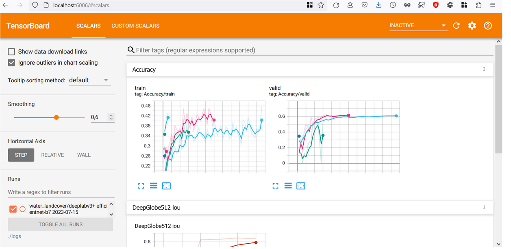
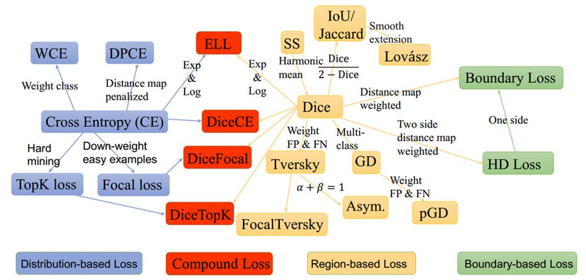

# PyTorch Segmentation models Trainer
 Код для обучения моделей сегментации. Модели сетей взяты из этой библиотеки: https://github.com/qubvel/segmentation_models.pytorch

## Содержание
[1. Установка проекта на локальном компьютере](#install)

[2. Пример запуска обучения](#run-example)

[3. Параметры обучения](#params)

[4. Требования к структуре набора данных](#dataset)

[5. Скрипты для подготовки данных](#utils)

[6. Просмотр графиков в Tensorboard](#tensorboard)

[7. Валидация - получение результатов сети на изображениях](#validation)

[8. Ускорение отладки](#speedup)

[9. Над чем можно эксперементировать?](#experiments)

## [>> Пример запуска проекта в Google Colab](https://colab.research.google.com/drive/13ELTM5zncaotpm2V865wV-uZPEAjcG0Q?usp=sharing)

## 1. Установка проекта на локальном компьютере <a name="install"></a>

* сделать fork репозитория;
* клонировать репозиторий на компьютер;
* установить библиотеки из requirements.txt.


**mkdir logs**

## 2. Пример запуска обучения <a name="run-example"></a>
Запуск алгоритма:
```
Запустить обучение сети можно одной строкой:
bash train.sh
# В файле train.sh необходимо корректно указать путь до набора данных
# и метку которым покрашена разметка целевого класса в строке CLASS_LIST="64"

или

python3 train.py [-h] [-m MODEL] [--encoder ENCODER] [--image-size IMAGE_SIZE]
                [--exp-name EXP_NAME] [--class-list CLASS_LIST]
                [--max-mask-val MAX_MASK_VAL] [-b BATCH] [-lr LR] [-e EPOCHS]
                [-a AUGMENTATION] [-w WORKERS] -d DATASET
                [--add-dirs ADD_DIRS] [-log LOG_DIR] [-val VAL_DIR]
                [--add-val-dirs ADD_VAL_DIRS] [--adv-freq ADV_FREQ]
                [--use-only-add-val] [--cpu] [--device DEVICE] [--seed SEED]
```

## 3. Параметры обучения <a name="params"></a>

| Short                         | Long           | Тип                 | Значение по умолчанию                                                                     | Описание                                                                                                                                                                                                                                                                                                        |
|-------------------------------|----------------|---------------------|-------------------------------------------------------------------------------------------|-----------------------------------------------------------------------------------------------------------------------------------------------------------------------------------------------------------------------------------------------------------------------------------------------------------------|
| -m                            | --model        | type=str            | default=deeplabv3+                                                                        | Имя модели. [Полный список моделей](https://github.com/qubvel/segmentation_models.pytorch?tab=readme-ov-file#models), поддерживаемых проектов. deeplabv3+ - самая продвинутая из них.                                                                                                                           |
| --encoder                     |                | type=str            | default=efficientnet-b0                                                                   | [Полный список энкодеров](https://github.com/qubvel/segmentation_models.pytorch?tab=readme-ov-file#encoders), поддерживаемых проектом.                                                                                                                                                                          |
| --image-size                  |                | type=int            | default=512                                                                               | Размер изображения, который принимает на вход сеть. Если снимки в обучающем наборе имеют другой размер, то они будут сжаты / растянуты до image-size.                                                                                                                                                           |
| --exp-name                    |                | type=str            | default=""                                                                                | В папке logs создается папка с именем эксперимента, если эксперимент с таким именем уже был, то обучение продолжится из чекпоинта (файла с сохраненными весами сети), если имя не задано оно сгенерируется автоматически: exp_name = model_name + ' ' + encoder_name + ' ' + str(datetime.date(datetime.now())) |
| -log                          | --log-dir      | type=str            | default=./logs/                                                                           | default='./logs/' В папке './logs/' создаются папки с экспериментами.                                                                                                                                                                                                                                           |
| **Метки классов**             |
| --class-list                  |                | type=str            | default="255"                                                                             | Список меток классов, на которых будет обучаться сеть. Числа разделенные пробелами, например:  '1 2 5'. По умолчанию '255' - означает что на маске два значения - 0 и 255. Класс 0 - фон указывать не нужно, он добавляется автоматически в случае обучения для двух или нескольких классов.                    |
| --max-mask-val                |                | type=int            | default=0                                                                                 | Использовать только если маска содержит метки от 1 до max-mask-val, чтобы не перечислять их все в class-list.                                                                                                                                                                                                   |
| **Данные**                    |
| -d                            | --dataset      | type=str            |                                                                                           | Путь к набору данных, в котором есть папки train и val                                                                                                                                                                                                                                                          |
| --add-dirs                    |                | type=str            | default=None                                                                              | Список папок с дополнительными каналами снимка. Example: 'nir kv'. Дополнительные каналы должны быть одноканальными изображениями!                                                                                                                                                                              |
| -val                          | --val-dir      | type=str            | default=None                                                                              | Путь к val набору, если он не размещен рядом с папкой train.                                                                                                                                                                                                                                                    |
| --add-val-dirs                |                | type=str            | default=None                                                                              | Если хотим проверять качество сразу на нескольких val наборах, нужно указать путь к .txt файлу, где в отдельных строках пути к наборам.                                                                                                                                                                         |
| --adv-freq                    |                | type=int            | default=1                                                                                 | Как часто выполнять оценку качества на add-val-dirs                                                                                                                                                                                                                                                             |
| --use-only-add-val            |                | action='store_true' | Не запускать валидацию на папке val, считать только mIoU на папках из списка add-val-dirs |
| **Другие параметры обучения** |
| -b                            | --batch        | type=int            | default=6                                                                                 | **Размер батча должен быть четным числом**, а число примеров в папках train и val также четным.                                                                                                                                                                                                                 |
| -lr                           |                | type=float          | default=0.001                                                                             | Скорость обучения - параметр, который передается в оптимизатор.                                                                                                                                                                                                                                                 |
| -e                            | --epochs       | type=int            | default=50                                                                                | Количество полных проходов по всему train набору.                                                                                                                                                                                                                                                               |
| -a                            | --augmentation | type=str            | default=hard                                                                              | На выбор: hard, medium, light, safe. Наборы аугментаций описаны в файле augmentations.py проекта.                                                                                                                                                                                                               |
| --cpu                         |                | action='store_true' |                                                                                           | Запустить обучение на CPU. Может использоваться для проверки, что код работает, если видеокарта не доступна. Для целей отладки лучше всего создать набор данных с 4мя примерами.                                                                                                                                |
| --device                      |                | type=str            | default=cuda                                                                              | default=cuda                                                                                                                                                                                                                                                                                                    | or cpu|
| --seed                        |                | type=int            | default=42                                                                                | Random seed default=42                                                                                                                                                                                                                                                                                          |
| -w                            | --workers      | type=int            | default=1                                                                                 | Число потоков, которые считывают данные с диска. Обращайте внимание на warnings в логах обучения. В них подсказывают оптимальное число workers.                                                                                                                                                                 |


## 4. Требования к структуре набора данных <a name="dataset"></a>
Код принимает изображения нарезанные на квадратные фрагменты, в папке /images - 3х канальные изображения, в папке - /gt разметка в формате 0/255, 0/1 или 0..N, где N - количество классов, а 0 - фон. Также можно задавать метки классов (labels) произвольными целыми положительными числами.

Имена файлов снимка и разметки должны совпадать вплоть до расширения, поэтому желательно чтобы у всех файлов было расширение .tif. Каналы с дополнительными данными необходимо разместить в отдельных папках, например nir kv и т. д. имена файлов с отдельными каналами также должны полностью совпадать с именами в папке images.

**ВАЖНО**: количество примеров в наборе должно быть четным числом, код не работает при размере батча = 1. Минимальный размер батча - 2. Поэтому желательно, чтобы размер батча тоже был четным числом. Важно чтобы остаток от деления размера набора на размер батча был больше 1: len(dataset) % batch_size > 1.


```
Пример: в обучающем наборе есть снимок 1.tif, разметка хранится в папке gt, 
четвертый канал снимка хранится в папке nir
/dataset
    /train
        /images
         1.tif
        /nir
         1.tif
        /gt
         1.tif
    /val
        /images
        /nir
        /gt
```
## 5. Утилиты для подготовки данных
Утилиты для подготовки данных находятся в папке ./dataset_utils
## 6. Просмотр графиков в Tensorboard <a name="tensorboard"></a>
[TensorBoard](https://www.tensorflow.org/tensorboard?hl=ru) - удобный инструмент для логирования экспериментов в PyTorch и Tensorflow. Помимо построения графиков, в TensorBoard удобно сохранять N примеров с худшими метриками в конце каждой эпохи, для того чтобы понять, на чем модель ошибается больше всего.

Со всеми возможностями этого инструмента можно ознакомиться в официальной документации. 

Логи экспериментов находятся в папке logs.

из папки проекта вызываем:

**tensorboard --logdir=./logs**

нам сообщают url по которому можно посмотреть эксперименты http://localhost:6006/


Открываем ссылку в браузере.



Для сохранения логов эксперимента достаточно добавить в любой проект несколько строк. В данном проекте логирование уже подключено.

```
# устанавливаем библиотеку
pip install tensorboard 

# импортируем библиотеку
from torch.utils.tensorboard import SummaryWriter 

# создаем объект SummaryWriter, который будет писать логи в папку ./logs
writer = SummaryWriter('./logs') 

# передаем любое название графика, значение которое хотим записать в график, номер эпохи i
writer.add_scalar('Accuracy/train', train_logs['iou_score'], i) 
```

## 7. Валидация - получение результатов сети на изображениях <a name="validation"></a>

Пропустить все картинки через сеть можно двумя командами:
```
bash validate.sh

или

python3 validate.py -d путь_к_папке_val -cd путь_к_папке_с_чекпоинтом

python3 validate.py [-h] [-c CHECK_PATH] [-cd CHECK_DIR] [-t THRES]
                   [-d DATASET_DIR] [-o OUTPUT_DIR] [--vis] [--no-plots]
                   [--only-plots] [--com] [--tile-size TILE_SIZE] [--cpu]
                   [--device DEVICE]
```
Параметры, передаваемые в скрипт validate.py:

| Short        | Long                | Тип                 | Значение по умолчанию                         | Описание                                                                                                                                                                                      |
|--------------|---------------------|---------------------|-----------------------------------------------|-----------------------------------------------------------------------------------------------------------------------------------------------------------------------------------------------|
| -c           | --check-path        | type=str            |                                               | Полный путь до чекпоинта.                                                                                                                                                                     |
| -cd          | --check-dir         | type=str            |                                               | Путь папки где лежит *.pth файл. Если файлов несколько, то будет считан произвольный из них. Эта функция удобна, т.к. не требуется указывать имя чекпоинта, если файл чекпоинта один в папке. |
| -t           | --thres             | type=float          | default=0.5                                   | Порог для бинаризации выхода сети. Сеть выдает значения типа float от 0 до 1, а для подсчета метрик нужна бинарная разметка, и для этого используется порог.                                  |
| -d           | --dataset-dir       | type=str            |                                               | Путь к папке val или train. Важно что по пути --dataset-dir все картинки одинакового размера равному размеру тайла.                                                                           |
| -o           | --output-dir        | type=str            | По умолчанию output пишется в папку чекпоинта | Путь куда сохранить результаты.                                                                                                                                                               | 
| --vis        |                     | action='store_true' |                                               | visualize plot with result on one image                                                                                                                                                       |
| --no-plots   |                     | action='store_true' |                                               | Не сохранять графики на диск.                                                                                                                                                                 |
| --only-plots |                     | action='store_true' |                                               |                                                                                                                                                                                               |
| --com        | --calc-only-metrics | action='store_true' |                                               | Не сохранять выход сети на диск, только считать метрики.                                                                                                                                      |
| --tile-size  |                     | type=int            | default=512                                   | The size of images will be RESIZED to tile-size.                                                                                                                                              |
| --cpu        |                     | action='store_true' |                                               | Использовать cpu для вычислений.                                                                                                                                                              |
| --device     | type=str            | default=cuda        |                                               | cuda or cpu                                                                                                                                                                                   |


## 8. Ускорение отладки <a name="speedup"></a>
Отлаживать код удобно на своем компьютере. Для отладки полезно создать DEBUG набор, где будет например 4 примера и batch size=2, 
также можно уменьшать размер изображений --image-size=128 и брать легкий энкодер ENCODER="efficientnet-b0"

## 9. Над чем можно эксперементировать? <a name="experiments"></a>
1. Размер батча - стоит выбрать максимально возможный размер при котором скрипт не падает. 


2. Аугментации. Файл augmentations.py. Название типа аугментации передается как аргумент скрипта train.py и в строке 88 файла dataset.py с помощью метода get_augmentations(augmentation, self.in_channels == 3).
Аугментации реализованы через библиотеку https://github.com/albumentations-team/albumentations На странице библиотеки можно ознакомиться с вариантами искажений. Важно: аугментации применяются и к изображению, и к разметке. Это реализовано в строке 172 dataset.py  data = self.transform(image=image, mask=mask)
Если раскомментировать строку 120 файла train.py valid_set.test_augment(...) можно сохранить на диск примеры изображений после аугментации.


3. Функции потерь.  https://github.com/qubvel/segmentation_models.pytorch/blob/master/segmentation_models_pytorch/utils/losses.py
 trainer.py строка 111   self._loss = smp.utils.losses.DiceLoss()

Функции потерь, применяемые для задач сегментации бывают:
* учитывающие распределение данных;
* комбинированные;
* отслеживающие области;
* отслеживающие границы.

Ссылки по теме:
https://ieeexplore.ieee.org/stamp/stamp.jsp?tp=&arnumber=9277638

https://github.com/JunMa11/SegLoss

Разнообразие функций потерь, используемых в задачах сегментации изображений:



4. Энкодеры. Имя энкодера принимается через аргументы скрипта train.py и передается в строке 162 train.py.
Подробнее про энкодеры: https://github.com/qubvel/segmentation_models.pytorch?ysclid=lolapme5co423950779#encoders
Необходимо найти баланс между качеством работы энкодера на задаче классификации изображений (обычно энкодеры - это сети классификации) и количеством весов энкодера. Слишком большой энкодер будет долго обучаться.


5. Оптимизаторы. https://pytorch.org/docs/stable/optim.html 
Задается в строке 116 trainer.py  self._optimizer = torch.optim.Adam


6. Расписание (Scheduler) https://pytorch.org/docs/stable/optim.html 
trainer.py строка 120 self._scheduler = torch.optim.lr_scheduler.CosineAnnealingLR


7. Модели. Выбор моделей в этом проекте не велик. Они достаточно старые, в них нет attention слоев как в современных архитектурах.
Согласно рейтингу лучшая из поддерживаемых этим проектом моделей - DeepLab v3+.
Лучшие модели сегментации представлены в рейтингах [ADE20k](https://paperswithcode.com/sota/semantic-segmentation-on-ade20k) и [CityScapes](https://paperswithcode.com/sota/semantic-segmentation-on-cityscapes-val). Также для решения задачи сегментации можно дообучить Segment Anything Model или использовать библиотеку mmsegmentation.

Сравнение архитектур проекта Segmentation models по mIOU:


